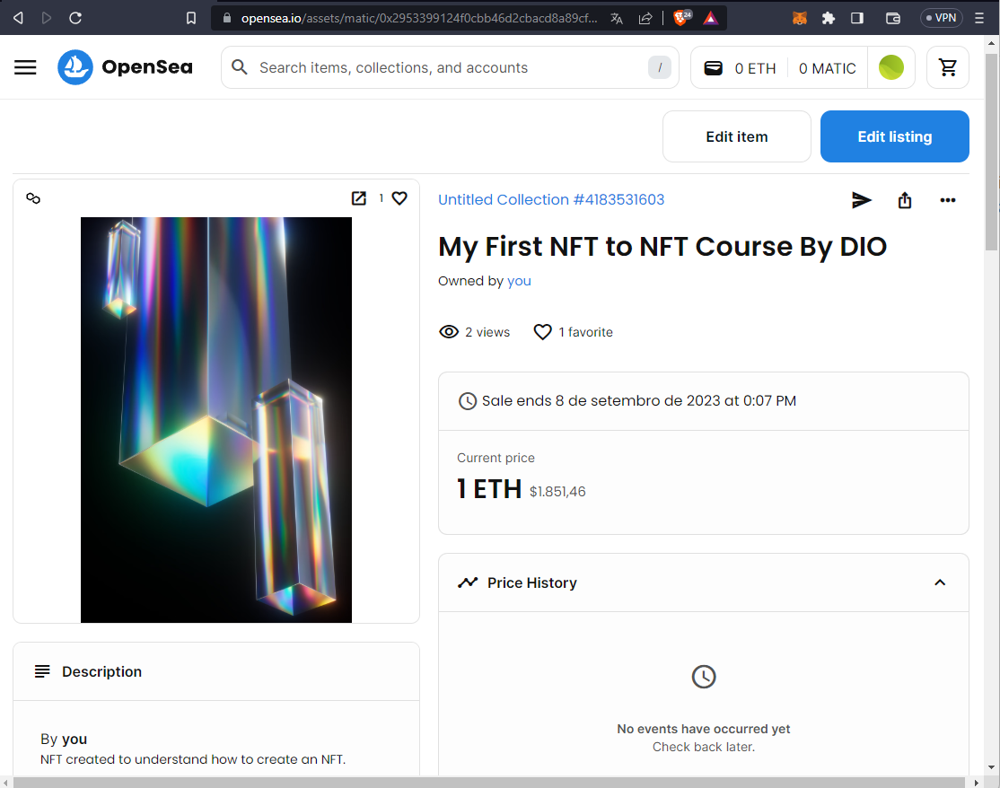

# DIO Challenge WEB3 Fundamentals - Creating a NFT

DIO - Web3 Fundamentals Training - Challenge "Creating an NFT in Practice"

In this Challenge, a Non-Fungible Token, the famous NFT, was created on the free Blockchain OpenSea Polygon.

## NFT created

    
     NFT on OpenSea

**Details**

* Contract Address  [0x2953...4963](0x2953399124F0cBB46d2CbACD8A89cF0599974963)
* Token ID          [2328796086128469...](23287960861284699164176165920014419200666918877560233883882458045609658023937)
* Token Standar     ERC-1155
* Chain             [Polygon](https://polygonscan.com/address/0x2953399124f0cbb46d2cbacd8a89cf0599974963)

## License 📄

Code released under the [MIT License](./LICENSE).

Make by [Leonardo Cairo](https://www.linkedin.com/in/leocairos/)!